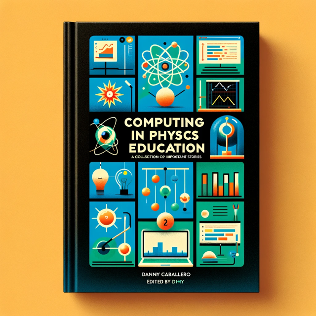

## Concept and Focus

This page organizes the materials for contributing authors to the upcoming book on Computing in Physics Education. This book was developed from an initial request by editors from the [Institute of Physics](https://iopscience.iop.org/) to author a book on the integrating of computing into physics courses. The concept has developed into an edited volume that focuses on a variety of stories from different persons and places around the world who are teaching computing in their physics courses.

## Timeline

The timeline for the book is as follows:

- **Dec 2023**: Initial Concepts and Chapter Proposals
- **Feb 2024**: Reviews and Meeting with Authors
- **Mar 2024**: Accepted Chapter Authors Notified
- **Aug 2024**: First Drafts Due
- **Oct 2024**: Reviews and Meeting with Authors
- **Dec 2024**: Final Drafts Due

## Materials for Contributing Authors

Below are the materials needed for contributing authors to prepare their chapters. Chapters should be roughly 12-18 pages in length and should be written in LaTeX or Google Docs/Word. The final book will be published by IOP.

### Identifying Information (Needed by Apr 15, 2024)

Information is needed from authors for IOP to prepare contracts. Please [complete this following form](https://docs.google.com/spreadsheets/d/1C5QJ8VfeEADaeuqTEH_NSmtb6U4PLRLG6RlRyOiPN1g/edit#gid=1632730539) by Apr 15, 2024.

### Chapter Guidelines and Templates

IOP includes a set of guidelines for authors. Please review the [IOP Author Guidelines](https://publishingsupport.iopscience.iop.org/publishing-support/authors/authoring-for-journals/). In addition, there are the following materials to help authors prepare their chapters:

* [Author Checklist](../assets/pdf/IOP/Author%20Submission%20Checklist.pdf)
* [Author Handbook](../assets/pdf/IOP/Author%20Handbook.pdf)
* [Credit Line Example](../assets/pdf/IOP/Credit%20Line%20Examples%20For%20Authors.pdf)
* [Permissions Guide](../assets/pdf/IOP/Permissions%20Guide.pdf)
* [LaTeX Template](../assets/zip/latex%20ebook.zip)
* [Google Docs Template](https://docs.google.com/document/d/11mcN3I0lJ8Nos7yh1Bf_JY_nbuBCC58uPByW2DlQGjU/edit#heading=h.gjdgxs)

## Preliminary contributions

**Questions?** Authors may contact [Danny Caballero](mailto:caball14@msu.edu) or [make an appointment to meet](https://cal.com/dannycaballero/iop-book).

The authors listed below have proposed the following initial chapters (order and full authorship TBD):

|----------------------------------------------------|---------------------------------------------------------------------------------------------------------------------------|
| **Authors** | **Preliminary Chapter Title** |
| -------------------------------------------------- | ------------------------------------------------------------------------------------------------------------------------- |
| K. Svennson and U. Erickson | Teachers’ approach to computation in physics classrooms analyzed using social semiotics and variation theory of learning |
| F. Salsbury and L. Gao | Advancing Mechanics Education: Integrating Computational Methods Into Sophomore-level Mechanics at Wake Forest University |
| B. Zwickl, C. Lusignan, and A. McGowan | Integrating computation into a physics bachelor’s laboratory curriculum |
| T. Atherton, A. Phillips, B. Gravel, and E. Gouvea | Agency and Making in Computational Learning Environments |
| W. B. Lane and T. Galanti | Computing in General Education Physics |
| R. C. Mastroleo and B. Lunk | Departmental Emphasis on Computation for the Physics Major: Successes and Failures of a multi-tier curricular redesign |
| N. Nelson | Integrating Computation and Experiment in Upper-Division Physics |
| D. McPadden | Building Computing Skills in Large-Scale Introductory Physics Classrooms |
| T. Odden | Teaching Scientific Writing using Computational Essays |
| M. Lopez del Puerto, L. Engelhardt, and K. Roos | Resources for Integrating Computation into Physics Courses: Exercise Sets, Workshops, and a Supportive Community |
| A. Escuadro, J. Farrel, and J. Millan | Implementing Computational Activities Across the TYC Physics Curriculum at City Colleges of Chicago |
| D. O'Neil | Integration of computation across the curriculum at Bridgewater College |
| B. Lunk and S. Weatherford | Student Engagement with Computational Models and the Development of the "Minimally Working Program" Instructional Tool |
| D. Silvia, R. Frisbie, and S. Tessmer | Supporting Computing in Physics Education with Modeling, Data Science, and Machine Learning |
| M. Hamilton | Integrating Computation in Physics: From High School Internships to Graduate Studies at Marshall University |